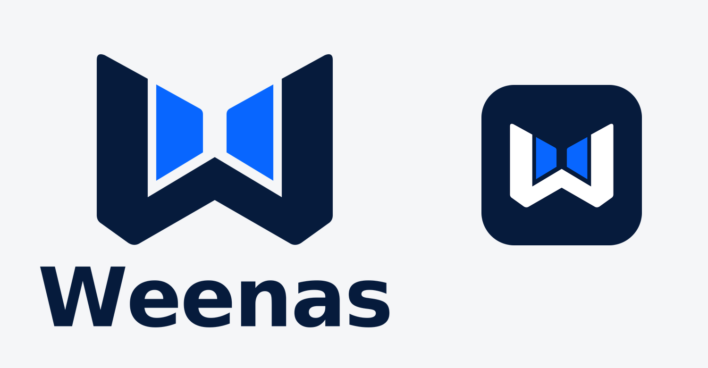

# Weenas 品牌资源：对称蓝色版本

依据确认的图像概念重新绘制。所有 SVG 均为矢量路径，无嵌入位图，Weenas 文字已转曲；左右图形及蓝色区域为精确镜像。以 `svg/` 下的文件作为后续导出的母版。

配色：深蓝 `#061B3C`，亮蓝 `#0866FF`。
字标使用 DejaVu Sans Bold 的字形轮廓并调整字距，与生成概念图中的字形存在细微差异。

## 目录

| 路径 | 内容 |
| --- | --- |
| `svg/weenas-logo-stacked.svg` / `-horizontal.svg` | 上下组合、左右组合 Logo（浅色背景用） |
| `svg/weenas-symbol.svg` | 独立符号（浅色背景用） |
| `svg/*-reverse.svg` | 反白版：深蓝换成白色、亮蓝不变，深色背景用（由对应母版派生） |
| `svg/weenas-symbol-black.svg` / `-white.svg` | 单色符号 |
| `svg/weenas-app-icon.svg` | 圆角 App 展示图标（深蓝底） |
| `svg/weenas-app-icon-square.svg` | 无圆角方形 App 母版（深蓝底） |
| `png/` | 按母版导出的 PNG，文件名数字为像素宽度；Logo 与符号为透明背景，App 图标含深蓝底 |
| `favicon/` | 16–256 px favicon PNG、多尺寸 `favicon.ico`、`apple-touch-icon.png`、`site.webmanifest` |
| `preview.png` | 浅色背景效果预览 |

小尺寸 PNG 为矢量母版直接缩放导出，未逐像素手工修整。
SVG 使用普通 path 与镜像变换，可在常见矢量编辑器中编辑；如需独立编辑镜像侧，解除编组并应用变换即可。

## 在主页中的使用

- 页眉符号与首屏 Logo 用 SVG，通过 `<picture>` 在深色模式下切换到 `-reverse` 版本。
- 浏览器标签页：`svg/weenas-app-icon.svg`，以及 `favicon/favicon.ico`、`favicon-32.png`、`favicon-16.png`。
- iOS 主屏幕：`favicon/apple-touch-icon.png`（由 `png/weenas-app-icon-square-512.png` 缩放，不透明方形，圆角由 iOS 添加）。
- 分享预览图：`png/weenas-app-icon-square-1024.png`。
